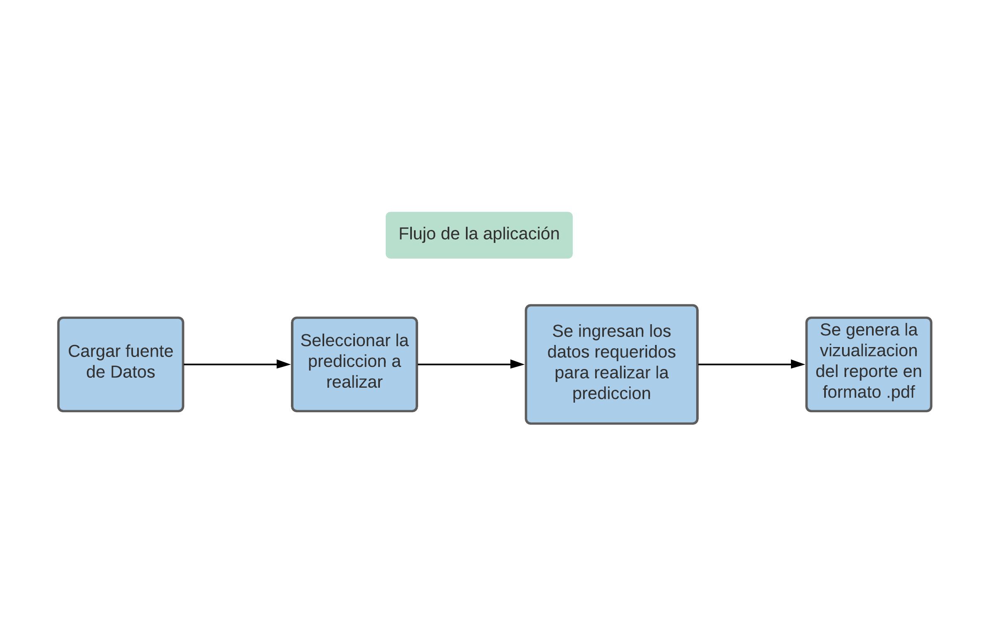
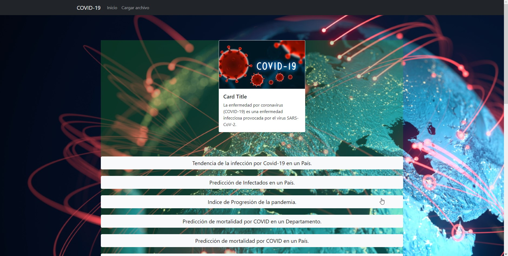
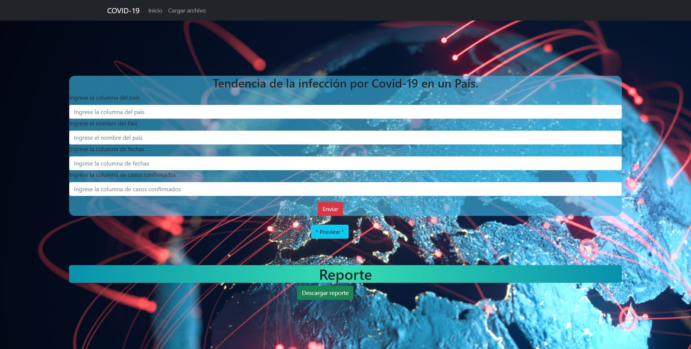
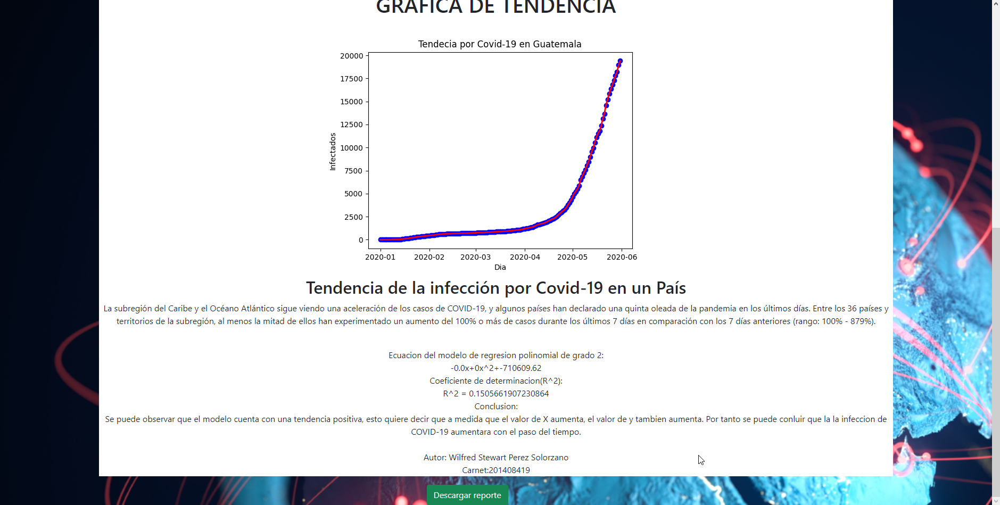
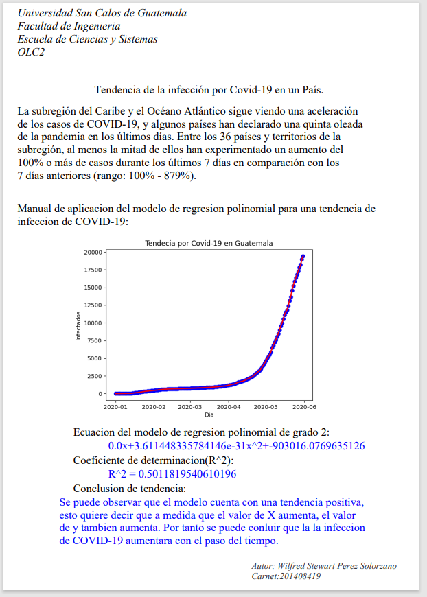

# Universiad San Carlos de Guatemala
# Faculta de Ingenieria
# Escuela de Ciencias y Sistemas
# Organizacion de Lenguajes y Compiladores 2
# Ing. Luis Espino


## <center> Manual Tecnico </center>
## <center>    Coronavirus Data Analysis With Machine Learning  </center>

### Vision General

Durante la emergencia sanitaria provocada por el COVID-19, se ha observado un notable incremento en la aplicación de nuevas tecnologías al campo de la salud y la investigación. Desde la creación de todo tipo de dispositivos inteligentes destinados a detectar el más mínimo síntoma indicativo de contagio, hasta el diseño de nuevos patrones de investigación en la cura del nuevo coronavirus.

Sin duda, la IA (Inteligencia Artificial) ha estado presente en todas y cada una de las etapas de esta pandemia, e incluso en momentos previos a ella. En este sentido, se trató de una startup canadiense –BlueDot- que, gracias a un algoritmo basado en inteligencia artificial, logró predecirlo.

Mediante el procesamiento y análisis de noticias de todos los países del mundo, junto con información relacionada con rutas de vuelos comerciales y brotes de enfermedades, pudieron predecir, no solo la existencia de una enfermedad potencialmente pandémica, sino también el epicentro de la enfermedad. Así mismo, como su trayectoria más inmediata.

Así, la aplicación de la IA en esta pandemia global ha supuesto un antes y un después en el campo epidemiológico, ya que no solo ha permitido establecer un mayor control sobre la propagación del virus, sino que ha participado activamente en el diagnóstico, tratamiento. e investigación para poner fin a este brote lo antes posible.

En la actual pandemia que vive el mundo, el COVID-19 ha tenido grandes variaciones y tiende a ser engañoso debido a las nuevas olas derivadas del relajamiento social, las nuevas variantes y mutaciones que tenido el virus, asi tambien hoy en día existen varios factores que dificultan las comparaciones entre países, existen diferencias de una nación a otra, así como casos no detectados o reportados de la enfermedad, además existen diferentes tipos de pruebas, estrategias de detección, pero esto está limitado por las diferentes definiciones y formas de clasificación, como casos leves o asintomáticos que no son habitualmente contabilizados, porque no se reportan, por lo que la calidad de la atención también puede ser determinante, aun así es importante contar con modelos con los que sea posible predecir el comportamiento de la enfermedad de tal manera que se puedan tomar medidas preventivas en el a nivel poblacional para evitar el contagio, así como un mayor cuidado con las personas de alto riesgo, en dichos procesos de características y factores determinantes, diferentes características de los pacientes en los diferentes análisis realizados a lo largo del siguiente informe, edad, sexo, nacionalidad, entre otros.

A continuación se tratará de cómo ha evolucionado la pandemia del covid-19 desde el primer día que llegó a Guatemala y a algunos países de América, como Honduras, Costa Rica, Estados Unidos, e incluso una comparativa con países del otro lado del mundo como China. abordando preguntas sobre la tasa de mortalidad, número de personas infectadas por día, porcentaje de muertes según casos activos, porcentajes de vacunación, entre otros.

Todos los datos recopilados y mostrados han sido extraídos de las bases de datos públicas de cada país que rastrean esta información. Con esta información y utilizando el lenguaje de programación Python y su biblioteca Sckit-learn, es posible analizar y predecir los datos que se mostrarán a continuación.


### Objetivos

1. Implementar una pagina capas de mostrar las distintas consultas utilizando la libreria de Machine Learning Scickit Learn.
2. Aplicar conocimientos de Inteligencia Artificial para relizar los distintos calculos para el analisis de datos sobre el COVID-19
3. Implementar la estructura usando BackEnd y FontEnd para el consumo del servicio de Scickit Learn

### Especificaciones

*   Utilizacion de la herramienta de analisis de datos Scickit-Learn.
*   Implementar una interfaz web utilizando cualquier Framework para la visualizacion de las consultas requeridas.
*   Utilizacion de APIs para el manejo de imformacion entre el Front End y Back End

### Requisitos del sistema
*   Hardware
    *   Mouse
    *   Teclado
    *   Monitor
    *   CPU
    *   Tarjeta de Red

*   Software
    *   Sistema operativo Windows
    *   Navegador Web

### Software utilizado

*   Visual Studio Code
    *   Es un editor de código fuente desarrollado por Microsoft para Windows , Linux y macOS . Incluye soporte para depuración , control de Git integrado, resaltado de sintaxis , finalización de código inteligente , fragmentos de código y refactorización de código . También es personalizable, de modo que los usuarios pueden cambiar el tema del editor, los métodos abreviados de teclado y las preferencias. Es gratuito y de código abierto.
    El código combina la interfaz de usuario optimizada de un editor moderno con asistencia y navegación de código enriquecido y una experiencia de depuración integrada, sin la necesidad de un IDE completo. Visual Studio Code, cuenta con herramientas de Debug hasta opciones para actualización en tiempo real de nuestro código en la vista del navegador y compilación en vivo de los lenguajes que lo requieran (por ejemplo en el caso de SASS a CSS). Además de las extensiones, tendremos la posibilidad de optar por otros themes o bien configurarlo a nuestro gusto. Para modificar el esquema de colores y los iconos

### Lenguajes de Programacion utilizados
*   Phyton
    *   Python es un lenguaje de programación de alto nivel que se utiliza para desarrollar aplicaciones de todo tipo. A diferencia de otros lenguajes como Java o .NET, se trata de un lenguaje interpretado, es decir, que no es necesario compilarlo para ejecutar las aplicaciones escritas en Python, sino que se ejecutan directamente por el ordenador utilizando un programa denominado interpretador, por lo que no es necesario “traducirlo” a lenguaje máquina. Python es un lenguaje sencillo de leer y escribir debido a su alta similitud con el lenguaje humano. Además, se trata de un lenguaje multiplataforma de código abierto y, por lo tanto, gratuito, lo que permite desarrollar software sin límites. Con el paso del tiempo, Python ha ido ganando adeptos gracias a su sencillez y a sus amplias posibilidades, sobre todo en los últimos años, ya que facilita trabajar con inteligencia artificial, big data, machine learning y data science, entre muchos otros campos en auge. 
##
##
*   JavaScript - React JS
    *   React es una librería Javascript focalizada en el desarrollo de interfaces de usuario. Así se define la propia librería y evidentemente, esa es su principal área de trabajo. Sin embargo, lo cierto es que en React encontramos un excelente aliado para hacer todo tipo de aplicaciones web, SPA (Single Page Application) o incluso aplicaciones para móviles. Para ello, alrededor de React existe un completo ecosistema de módulos, herramientas y componentes capaces de ayudar al desarrollador a cubrir objetivos avanzados con relativamente poco esfuerzo.
    Por tanto, React representa una base sólida sobre la cual se puede construir casi cualquier cosa con Javascript. Además facilita mucho el desarrollo, ya que nos ofrece muchas cosas ya listas, en las que no necesitamos invertir tiempo de trabajo. En este artículo te ampliaremos esta información, aportando además diversos motivos por los que usar React como librería del lado del cliente.

##
### Librerias utilizadas
*   Scikit-Learn
    *   Scikit-Learn es una de estas librerías gratuitas para Python. Cuenta con algoritmos de clasificación, regresión, clustering y reducción de dimensionalidad. Además, presenta la compatibilidad con otras librerías de Python como NumPy, SciPy y matplotlib.
    La gran variedad de algoritmos y utilidades de Scikit-learn la convierten en la herramienta básica para empezar a programar y estructurar los sistemas de análisis datos y modelado estadístico. Los algoritmos de Scikit-Learn se combinan y depuran con otras estructuras de datos y aplicaciones externas como Pandas o PyBrain.
    La ventaja de la programación en Python, y Scikit-Learn en concreto, es la variedad de módulos y algoritmos que facilitan el aprendizaje y trabajo del científico de datos en las primeras fases de su desarrollo. La formación de un Máster en Data Science hace hincapié en estas ventajas, pero también prepara a sus alumnos para trabajar en otros lenguajes. La versatilidad y formación es la clave en el campo tecnológico.

##
*   jsPDF
    *   jsPDF es una librería para Java Script que permite generar documentos PDF a partir de una plantilla HTML o directamente por programación. Esto nos permite poder diseñar un documento PDF de manera sencilla y adaptable.
    Una ventaja importante que se obtiene al utilizar esta librería es la de no utilizar recursos en el servidor ya que sólo se ejecuta del lado del cliente (navegador).

##
*   Reacstrap
    *   A diferencia de algunas bibliotecas de componentes, Reactstrap no incorpora sus propios estilos, sino que depende del marco CSS Bootstrap para sus estilos y tema. Esto le permite tener estilos consistentes en sus componentes basados ​​en React y partes estáticas de su sitio, y le permite incluir su propio tema Bootstrap personalizado cuando sea necesario.
    A diferencia del uso de Bootstrap en HTML, Reactstrap exporta automáticamente todas las clases de Bootstrap correctas y no necesita usar o incluir archivos JavaScript de Bootstrap ni agregar atributos de datos para activar la funcionalidad. En cambio, los componentes se definen en componentes compatibles con React con los accesorios adecuados para que los controle.
##

*   React-Bootstrap 
    *   reemplaza Bootstrap JavaScript. Cada componente se ha construido desde cero como un verdadero componente de React, sin dependencias innecesarias como jQuery.
    Como una de las bibliotecas de React más antiguas, React-Bootstrap ha evolucionado y crecido junto con React, lo que la convierte en una excelente opción como base de la interfaz de usuario.


### Instalacion de Librerias
*   Scikit-Learn
```
$ pip install -U scikit-learn
```

*   Reactstrap
```
$ npm install --save bootstrap
```

*   React-Bootstrap
```
$ npm install react-bootstrap bootstrap@5.1.3
```

*   jsPDF
```
$ npm install jspdf --save
```

## Iniciando proyecto react App
Create React App es un ambiente cómodo para aprender React, y es la mejor manera de comenzar a construir una nueva aplicación de página única usando React.

Create React App configura tu ambiente de desarrollo de forma que puedas usar las últimas características de Javascript, brindando una buena experiencia de desarrollo, y optimizando tu aplicación para producción. Necesitarás tener Node >= 14.0.0 y npm >= 5.6 instalados en tu máquina. Para crear un proyecto ejecuta:

```
npx create-react-app my-app
cd my-app
npm start
```
  

## <center>Manual de usuario</center>
Esta aplicación tendrá como objetivo principal que un usuario pueda generar distintos análisis de información basados de un origen de datos (un archivo en Excel) y diferentes variables que se deberán configurar dentro del sistema según sea el ánalisis a realizar.
La aplicación deberá ser capaz de poder analizar y predecir lo siguiente:

* Tendencia de la infección por Covid-19 en un País.
* Predicción de Infertados en un País.
* Indice de Progresión de la pandemia.
* Predicción de mortalidad por COVID en un Departamento.
* Predicción de mortalidad por COVID en un País.
* Análisis del número de muertes por coronavirus en un País.
* Tendencia del número de infectados por día de un País.
* Predicción de casos de un país para un año.
* Tendencia de la vacunación de en un País.
* Ánalisis Comparativo de Vacunaciópn entre 2 paises.
* Porcentaje de hombres infectados por covid-19 en un País desde el primer caso activo
* Ánalisis Comparativo entres 2 o más paises o continentes.
* Muertes promedio por casos confirmados y edad de covid 19 en un País.
* Muertes según regiones de un país - Covid 19.
* Tendencia de casos confirmados de Coronavirus en un departamento de un País.
* Porcentaje de muertes frente al total de casos en un país, región o continente.
* Tasa de comportamiento de casos activos en relación al número de muertes en un continente.
* Comportamiento y clasificación de personas infectadas por COVID-19 por municipio en un País.
* Predicción de muertes en el último día del primer año de infecciones en un país.
* Tasa de crecimiento de casos de COVID-19 en relación con nuevos casos diarios y tasa de muerte por COVID-19
* Predicciones de casos y muertes en todo el mundo - Neural Network MLPRegressor
* Tasa de mortalidad por coronavirus (COVID-19) en un país.
* Factores de muerte por COVID-19 en un país.
* Comparación entre el número de casos detectados y el número de pruebas de un país.
* Predicción de casos confirmados por día.


  

### Objetivos

1. Implementar una pagina capas de mostrar las distintas consultas utilizando la libreria de Machine Learning Scickit Learn.
2. Aplicar conocimientos de Inteligencia Artificial para relizar los distintos calculos para el analisis de datos sobre el COVID-19
3. Implementar la estructura usando BackEnd y FontEnd para el consumo del servicio de Scickit Learn

### Flujo de Aplicación
A continuación, se explica el flujo de la aplicación. La aplicación es sencilla por lo que su funcionalidad se basa en cargar una fuente de datos, selección el análisis y parametrización de campos y desplegar reportes.
Carga de Fuente de Datos: Esta opción será la encargada de cargar una fuente en formato de .csv, .xls, .xlsx y .json

* Parametrización: Esta opción nos va a permitir vincular los nombres de los campos de los archivos, con los nombres de las variables que la aplicación utilice para poder hacer una correcta vinculación de la información.

* Selección de Análisis: Con esto seleccionaremos el tipo de predicción y análisis a realizar.

* Reportes: Esta opción nos va a permitir visualizar los reportes generados después de ánalizar un archivo y posterior la descarga en PDF de este.

### Flujo de la Aplicación



## Imagenes de la aplicación

* ### Pantalla de carga de archivos


* ### Pantalla con la lista de consultas


* ### Pantalla para la primera consulta


* ### Pantalla de preview de PDF


* ### Pantalla del documento descargado



